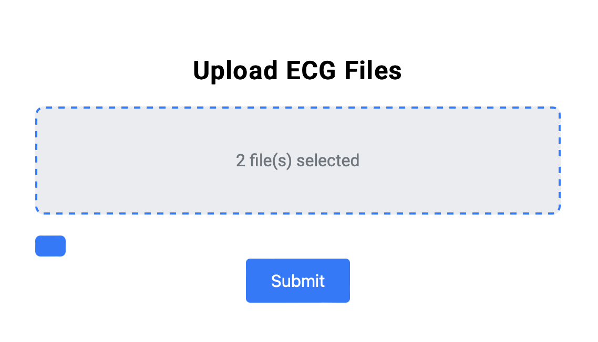
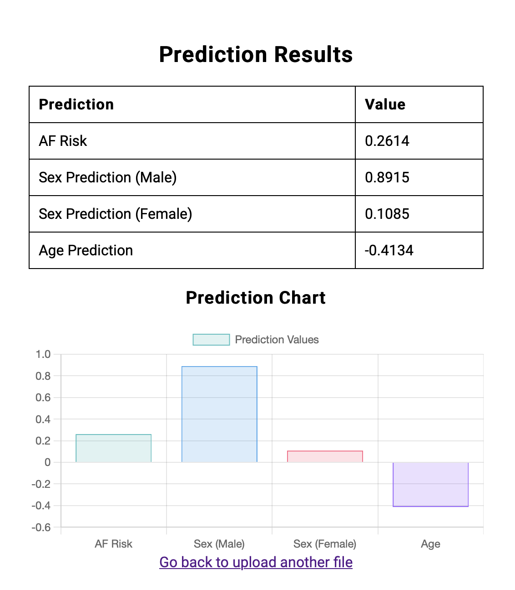

# ECG2AF Model Web Application

Welcome to my **ECG2AF Prediction Web App**! This app demonstrates how we can deploy a simple clinical AI model, ECG2AF, which predicts the risk of developing atrial fibrillation (AF) from ECG data.

In this tutorial, you’ll learn how to set up, run, and use the app.



## Background

AI is widely used in clinical applications to improve risk stratification and intervention. For example, neuroscientists and psychiatrists use AI to understand how the human brain functions and to identify the roots of certain psychopathological disorders. However, this project focuses on cardiovascular disease, specifically aiming to predict AF risk based on ECG data.
I launched this app on AWS, enabling users to upload an ECG file, process it with the ECG2AF model, and view the prediction results.

### Objective

1. **Create a web application** that allows users to:
   - Upload an ECG file (.hd5 format).
   - Process the uploaded ECG using a pre-trained ECG2AF model.
   - Display the prediction results, including four output values.

## How It Works

1. **Upload your ECG file** in `.hd5` format by dragging and dropping it into the upload area.
2. **Process with ECG2AF**: The model will process the file in real time.
3. **View Predictions**: At the end, the app displays four predictions for each ECG file, including AF risk and demographic estimations.

### Prediction Outputs

- **AF Risk**: Estimated risk for developing atrial fibrillation.
- **Sex Prediction (Male/Female)**: Probability-based estimate of biological sex.
- **Age Prediction**: Estimated age based on ECG data.
- **AF In Read (Yes/No)**: Classification for AF presence in the read.

Each prediction result includes a probability or estimate, displayed in both a table and a chart for easy viewing.



## Try It Out!

The app is live [here](http://34.204.36.84:5000/)! 

All you need to do is:
1. Open the link.
2. Drag and drop your `.hd5` ECG file onto the upload area.
3. Wait a few seconds, and you’ll see the predictions displayed for you!

## Scalability Considerations

The current version can support multiple file submissions. Yet, they will be processed in sequence. If we were to scale this solution for larger data volumes and a higher number of users, here’s what we’d consider:

1. **Batch Processing**: Process multiple ECG files simultaneously using a distributed system or Python's built-in ``multiprocessing`` functions like ``Pool``. 
2. **Database and Caching**: Store previously uploaded `.hd5` files on disk for each user separately, allowing them to choose from their past uploads to avoid reprocessing
3. **Cloud Deployment and Load Balancing**: Since we have deployed our tool on AWS, perhaps using other built-in functionalities like  Elastic Load Balancer (ELB) can help us with this. However, according to AWS documentation when you use Elastic Load Balancing with your Auto Scaling group, it's not necessary to register individual EC2 instances with the load balancer. Instances that are launched by your Auto Scaling group are automatically registered with the load balancer. Likewise, instances that are terminated by your Auto Scaling group are automatically deregistered from the load balancer.

## Technical Requirements

The app is built with Flask and TensorFlow for ease of deployment and model integration.

- **Python Version**: 3.6+
- **Libraries**: Flask, TensorFlow, and other dependencies in `requirements.txt`.

To run the app locally, you can clone this repository, set up a virtual environment, install dependencies, and run `app.py`. For more detailed steps, check below.

## Local Setup

To run this app locally:

1. **Clone the repository**:
   ```bash
   git clone https://github.com/your-username/ecg2af.git
   cd ecg2af
   ```

2. **Install dependencies**:
   ```bash
   pip install -r requirements.txt
   ```

3. **Run the Flask app**:
   ```bash
   python app.py
   ```

4. **Open the app**: Go to `http://127.0.0.1:5000` in your browser.

## Error Handling

We’ve designed the app to handle errors gracefully. Here’s how it responds:
- **Invalid File Format**: The app will prompt you to upload a valid `.hd5` ECG file if an incorrect format is uploaded.
- **Server Errors**: Any server errors during processing will display a user-friendly error message.

## Resources and References

- **ECG2AF Model**: [GitHub Link](https://github.com/broadinstitute/ml4h/tree/master/model_zoo/ECG2AF)
- **Model Setup**: We used the ML4H Docker container `ghcr.io/broadinstitute/ml4h:tf2.9-latest-cpu` for easy library setup.

Happy predicting, and let us know if you have any questions!

## Visualization and Results
The charts in the application that you see after submission, are bar charts created using the `Chart.js` library, an open source JavaScript package used for creating interactive and visually appealing data visualizations (see [chartjs](https://www.chartjs.org/)). Each chart presents predictions related to the uploaded .hd5 files, including AF risk, sex prediction (male and female), and age prediction values. 


