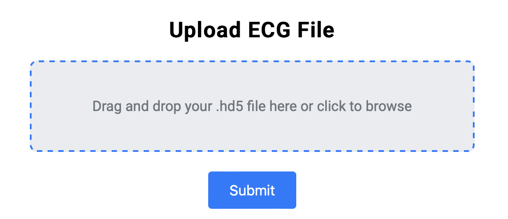

# ECG2AF Model Web Application

Welcome to the **ECG2AF Prediction Web App**! This app demonstrates how we can deploy a clinical AI model, ECG2AF, which predicts the risk of developing atrial fibrillation (AF) from ECG data.

This app was built as part of a take-home assignment for the ML4H Senior ML Engineer Position and is designed to showcase skills in deploying machine learning models within a user-friendly web interface. In this guide, you’ll learn how to set up, run, and use the app.



## Background

Our team focuses on developing clinical AI methods, and ECG2AF is one of our models built to predict AF risk based on ECG data. This app allows users to upload an ECG file, process it with the ECG2AF model, and view the prediction results.

This assignment simulates real-world tasks for deploying machine learning models in an application. It reflects objectives like technical skills, problem-solving, and creating a smooth user experience.

### Objective

1. **Create a web application** that allows users to:
   - Upload an ECG file (.hd5 format).
   - Process the uploaded ECG using the ECG2AF model.
   - Display the prediction results, including four output values.
2. **Scalability Question**: Explain how you would scale this solution to handle larger data volumes and more users (details in the "Scalability Considerations" section below).

## How It Works

1. **Upload your ECG file** in `.hd5` format by dragging and dropping it into the upload area.
2. **Process with ECG2AF**: The model will process the file in real time.
3. **View Predictions**: The app displays four predictions for each ECG file, including AF risk and demographic estimations.

### Prediction Outputs

- **AF Risk**: Estimated risk for developing atrial fibrillation.
- **Sex Prediction (Male/Female)**: Probability-based estimate of biological sex.
- **Age Prediction**: Estimated age based on ECG data.
- **AF In Read (Yes/No)**: Classification for AF presence in the read.

Each prediction result includes a probability or estimate, displayed in both a table and a chart for easy viewing.


## Try It Out!

The app is live [here](http://34.204.36.84:5000/)! 

All you need to do is:
1. Open the link.
2. Drag and drop your `.hd5` ECG file onto the upload area.
3. Wait a few seconds, and you’ll see the predictions displayed for you!

## Scalability Considerations

If we were to scale this solution for larger data volumes and a higher number of users, here’s what we’d consider:

1. **Batch Processing**: Process multiple ECG files simultaneously using a distributed system to handle large workloads.
2. **Database and Caching**: Store past results to avoid reprocessing, and use caching to speed up repeated requests.
3. **Containerization and Load Balancing**: Use Docker containers along with load balancers to distribute user traffic evenly and handle large volumes efficiently.
4. **Cloud Deployment**: Deploy to cloud platforms like AWS or Google Cloud with autoscaling to manage fluctuations in user demand.

## Technical Requirements

The app is built with Flask and TensorFlow for ease of deployment and model integration.

- **Python Version**: 3.6+
- **Libraries**: Flask, TensorFlow, and other dependencies in `requirements.txt`.

To run the app locally, you can clone this repository, set up a virtual environment, install dependencies, and run `app.py`. For more detailed steps, check below.

## Local Setup

To run this app locally:

1. **Clone the repository**:
   ```bash
   git clone https://github.com/your-username/ecg2af.git
   cd ecg2af```


## Install dependencies:

   ```bash
   pip install -r requirements.txt```


Run the Flask app:

    ```bash
   python app.py```

Open the app: Go to http://127.0.0.1:5000 in your browser.

## Error Handling

We’ve designed the app to handle errors gracefully. Here’s how it responds:

Invalid File Format: The app will prompt you to upload a valid .hd5 ECG file if an incorrect format is uploaded.
Server Errors: Any server errors during processing will display a user-friendly error message.
Resources and References
ECG2AF Model: GitHub Link
Model Setup: We used ML4H Docker container ghcr.io/broadinstitute/ml4h:tf2.9-latest-cpu for easy library setup.
Happy predicting, and let us know if you have any questions!
